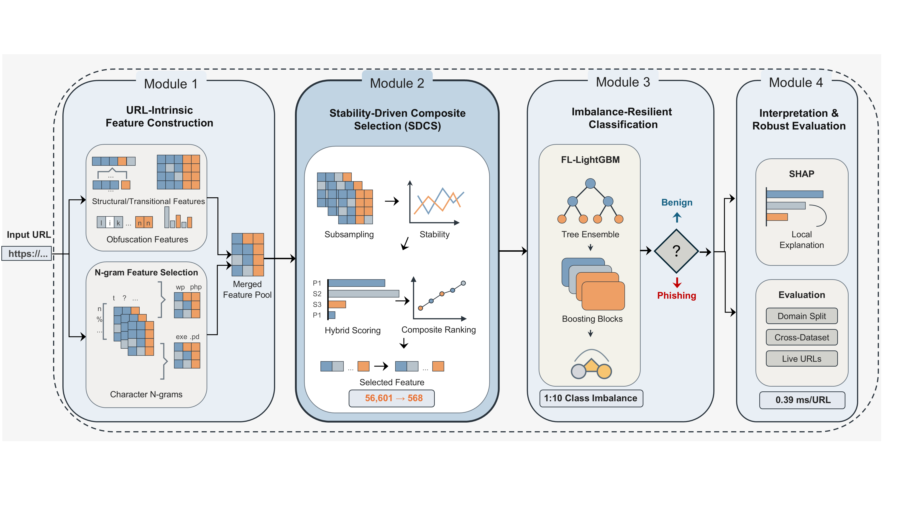

# LitePhish

This repository contains the implementation and evaluation workflows accompanying *LitePhish: Resource-Efficient URL-Intrinsic Phishing Detection for Consumer Electronics*. LitePhish combines 86 URL-intrinsic descriptors, selected character 2-/3-grams, Stability-Driven Composite Selection (SDCS), a focal-loss-inspired LightGBM objective, and SHAP analysis.



## Installation

```bash
git clone https://github.com/aI-area/PhishDetecting.git
cd PhishDetecting
conda create -n phishing python=3.9
conda activate phishing
pip install -r requirements.txt
```

The legacy URLNet baseline requires Python 3.7.12, TensorFlow 1.15.0, NumPy 1.21.6, and tflearn 0.3.2. TensorFlow/Keras baselines use separate compatible environments, as described in [`experiments/README.md`](experiments/README.md).

## Datasets and curation

CSV files use `url` and binary `phishing` columns, with phishing encoded as 1. The released `dataset/` directory contains:

- `PhishFusion.csv`: the curated primary corpus, obtained by combining the stated phishing sources and structurally diverse benign URLs, removing invalid rows and exact duplicates, and retaining URL strings and labels;
- `phishstorm.csv` and `ebbu2017.csv`: comparison corpora used for internal and source--target evaluation;
- `PhishTank.csv`: the independently collected PhishTank/Common Crawl external cohort;
- `merged.csv`: the merged corpus used for the supplementary keyword-frequency analysis.

Effective-second-level-domain-disjoint train/validation/test manifests are generated from each corpus with:

```bash
python -m experiments.create_domain_split_manifest dataset/PhishFusion.csv manifests --name PhishFusion --seed 42
python -m experiments.create_domain_split_manifest dataset/phishstorm.csv manifests --name PhishStorm --seed 42
python -m experiments.create_domain_split_manifest dataset/ebbu2017.csv manifests --name Ebbu2017 --seed 42
```

The generator records row identifiers, labels, split membership, candidate seeds, class counts, effective-domain counts, overlap checks, and SHA-256 hashes. Cross-dataset target cohorts are constructed with [`experiments/create_cross_dataset_transfer_cohort.py`](experiments/create_cross_dataset_transfer_cohort.py), which removes exact source-training/target URL overlap without using target labels for fitting or model selection.

## Fixed LitePhish configuration

- Character N-grams: analyzer `char`, range 2--3, `min_df=5`, `max_df=1.0`, variance threshold `1e-5`, MI/L1 weight `beta=0.5`, and top 5,000 candidates. Mutual information uses at most 20,000 source-training observations; L1 logistic ranking uses `C=0.5`.
- SDCS: 20 stability subsamples, fraction 0.905, L1-logistic inverse-regularization `C=0.191`, stability threshold 0.705, MI weight 0.318, stability weight 0.767, Pearson-correlation threshold 0.956, and maximum 1,000 retained features.
- Focal settings selected by source-validation phishing-class F1: PhishStorm `(gamma, alpha)=(0.55, 0.90)`, Ebbu2017 `(0.30, 0.95)`, and the primary PhishFusion model `(0.55, 0.95)`.
- Seeds: 42 for the primary split and paired compactness/resource analyses; 11, 22, 33, 44, 55, 66, 77, 88, 99, and 110 for repeated domain-split analysis; 42--51 for the paired focal-imbalance analysis.

The focal objective, including probability clipping at `1e-15` and the elementwise Hessian floor at `1e-6`, is implemented in `model.py` and in the released experiment runners.

## Reproducing Tables III--IX

The complete argument definitions and output schemas are documented by each command's `--help` option. Run the following entry points from the repository root, supplying dataset, manifest, artifact, baseline, and output paths as indicated:

| Table | Analysis | Commands |
| --- | --- | --- |
| III | Domain-disjoint internal comparison | Run the model-specific shared-split modules listed in `experiments/README.md`, then `python -m experiments.evaluate_saved_predictions --help` and `python -m experiments.aggregate_shared_split_metrics --help` |
| IV | Four source--target transfers | `python -m experiments.create_cross_dataset_transfer_cohort --help`; run the model-specific cross-dataset modules; then `python -m experiments.aggregate_cross_transfer_metrics --help` |
| V | Paired focal-imbalance analysis | `python -m experiments.run_focal_imbalance_ablation --help`; `python -m experiments.summarize_focal_comparison --help` |
| VI | Independent external cohort | `python -m experiments.evaluate_saved_predictions --help`; `python -m experiments.evaluate_grambeddings_predictions --help`; `python -m experiments.urlnet_convert_predictions --help` |
| VII | Common-protocol resource and energy analysis | `python -m experiments.benchmark_model_resources --help`; `python -m experiments.summarize_model_resources`; `python -m experiments.measure_cpu_energy --help` |
| VIII | Ten-seed stability analysis | `python -m experiments.run_litephish_experiments --experiment repeated_runs --dataset dataset/PhishFusion.csv --seeds 11 22 33 44 55 66 77 88 99 110 --outdir results/repeated_runs` |
| IX | Raw-versus-compact analysis | `python -m experiments.train_litephish_compactness_pair --help`; `python -m experiments.benchmark_litephish_compactness --help`; `python -m experiments.summarize_litephish_compactness --help` |

Prediction-level inference for Tables III, IV, and VI is obtained with:

```bash
python -m experiments.compare_model_predictions <prediction_root> <output_dir> --bootstrap 10000
```

This workflow performs exact McNemar tests for accuracy, paired multinomial-bootstrap inference for phishing-class F1, paired DeLong tests for ROC-AUC, and Holm correction within each table and metric family. The analysis covers 72 LitePhish--baseline scenario pairs.

Detailed workflow mappings, environment notes, provenance checks, and baseline-specific entry points are provided in [`experiments/README.md`](experiments/README.md). Supplementary methodology and results are available in [`Supplementary.tex`](Supplementary.tex).

## Primary pipeline

Set the dataset path in `main.py` to `dataset/PhishFusion.csv`, then run:

```bash
python main.py
```

The pipeline fits all representations and selectors on training data only and stores the trained inference artifacts in `artifacts/`.
